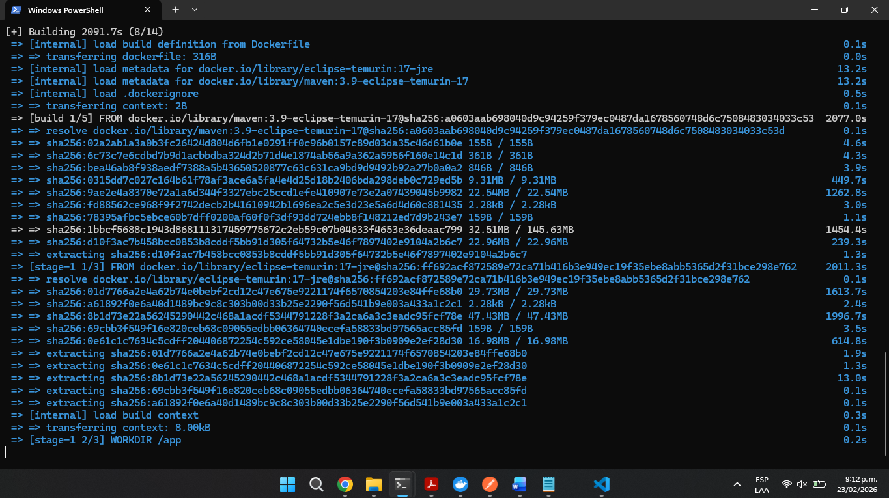
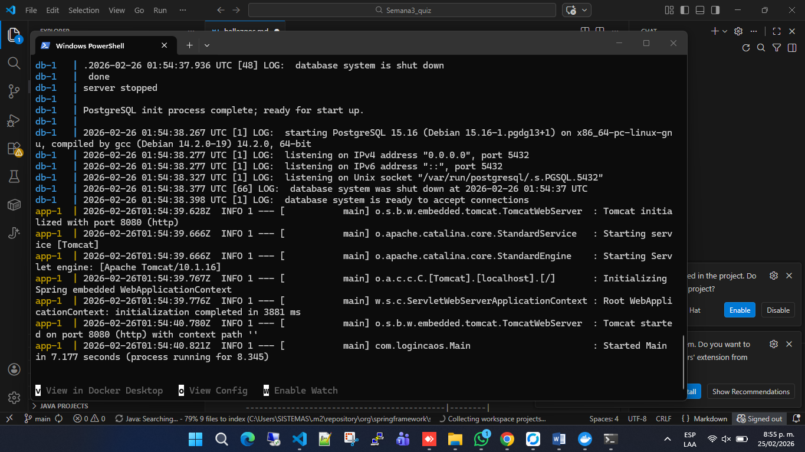
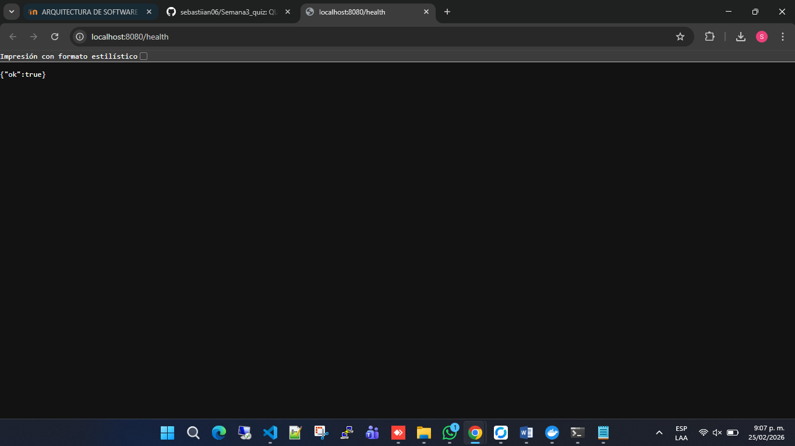
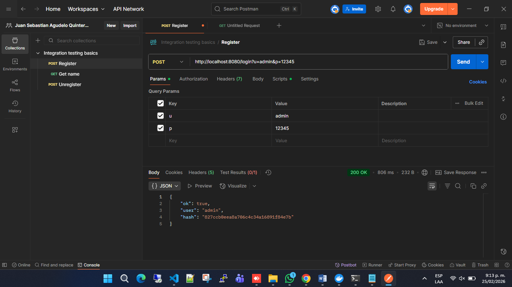
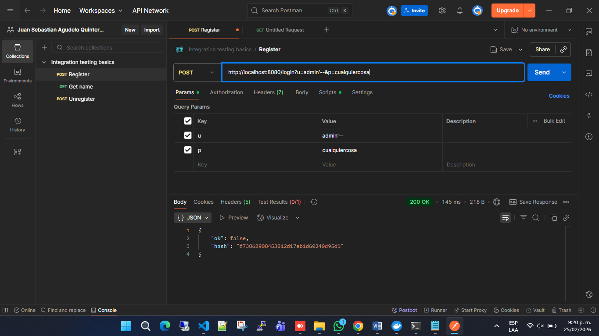
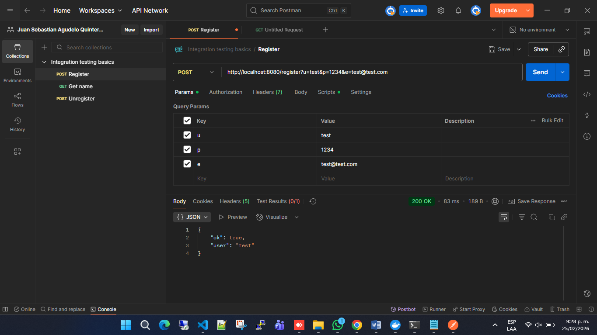

# FASE 1 — Levantar el ambiente
Clona el repositorio y levanta el proyecto:

Criterio de éxito: La app responde en http://localhost:8080/health con {"ok": true}

EJECUTANDO:

9:12 PM NO SE HA LEVANTADO EL PROYECTO POR FALLAS CON EL INTERNET 

(mira la hora profe 9:12pm y no ha levantado)

# FASE 1 — Levantar el ambiente (Oportunidad 2 fecha 25/02/2026)
Clona el repositorio y levanta el proyecto:
Criterio de éxito: La app responde en http://localhost:8080/health con {"ok": true}

PRUEBA LEVANTANDO CON DOCKER:

PRUEBA LA APP RESPONDE:

Levantamiento Exitoso 

-----------------------------------

# FASE 2 — Auditoría del código

| #  | Descripción del problema                                                                 | Archivo              | Línea aprox.        | Principio violado                          | Riesgo |
|----|------------------------------------------------------------------------------------------|----------------------|---------------------|--------------------------------------------|--------|
| 1  | Construcción de SQL concatenando parámetro u directamente en la consulta                | UserRepository.java | 22                  | Seguridad – SQL Injection                  | Alto   |
| 2  | Uso de Statement en vez de PreparedStatement                                             | UserRepository.java | 20, 36              | Seguridad / Buenas prácticas JDBC          | Alto   |
| 3  | Credenciales de base de datos hardcodeadas en el código                                 | UserRepository.java | 13–15               | Seguridad / Clean Code                     | Alto   |
| 4  | No se cierran conexiones, statements ni ResultSet                                       | UserRepository.java | 18–31, 34–38        | Buenas prácticas / Gestión de recursos     | Alto   |
| 5  | Uso de MD5 para hashing de contraseñas                                                   | AuthService.java    | 66                  | Seguridad (hash inseguro)                  | Alto   |
| 6  | Se retorna el hash de la contraseña en la respuesta del login                           | AuthService.java    | 31, 36              | Seguridad – Exposición de datos            | Alto   |
| 7  | Clase User con atributos públicos                                                        | User.java           | 4–6                 | Encapsulamiento / Clean Code               | Medio  |
| 8  | Nombres poco descriptivos (u, p, e, r, c, s)                                             | Varios archivos     | múltiples           | Clean Code – Naming                        | Bajo   |
| 9  | AuthService hace demasiadas responsabilidades (login, hashing, logs, reglas de password)| AuthService.java    | 18–63               | SOLID – SRP                                | Medio  |
| 10 | Validación débil de contraseña (solo longitud > 3)                                      | AuthService.java    | 45                  | Seguridad básica                           | Medio  |
| 11 | Uso de System.out.println para eventos sensibles                                         | AuthService.java    | 24–25, 32–33, 53–54 | Seguridad / Buenas prácticas logging       | Medio  |
| 12 | Uso de Map<String,Object> como respuesta en vez de DTO tipado                           | AuthController.java | 20, 26              | Clean Code / Diseño                        | Bajo   |

---

# FASE 3 — Pruebas funcionales

## Prueba 1 — Login válido

Código HTTP: 200 OK

### ¿Qué datos sensibles aparecen en la respuesta?
Aparece el campo:

"hash" → corresponde al hash MD5 de la contraseña ingresada (12345).

Este dato es información sensible, ya que expone directamente el valor hash de la contraseña del usuario autenticado.

---

### ¿Debería retornarse eso?

No. Bajo ninguna circunstancia el sistema debería retornar:
- La contraseña en texto plano.
- El hash de la contraseña.
- Información interna del proceso de autenticación.

Aunque el hash no sea la contraseña directamente, sigue siendo información crítica. Exponerlo facilita:
 
- Ataques de diccionario.
- Ataques por tablas rainbow.
- Análisis de seguridad por parte de un atacante.
---

## Prueba 2 — SQL Injection

Código HTTP: 200 OK

Aunque en esta ejecución específica el login devolvió "ok": false, el sistema sigue siendo vulnerable a SQL Injection debido a la forma en que construye las consultas SQL.

### ¿Qué ocurrió realmente?

El parámetro enviado (admin'--) intenta cerrar la cadena SQL y comentar el resto de la consulta.
El símbolo -- en SQL indica comentario, lo que puede eliminar condiciones adicionales de validación.

En este caso particular no logró autenticarse, pero la vulnerabilidad existe porque la consulta depende directamente de datos ingresados por el usuario sin sanitización ni parámetros preparados.

### ¿Por qué es peligroso en producción?

Es una vulnerabilidad crítica porque permite:
- Bypass de autenticación.
- Acceso no autorizado a cuentas.
- Exposición o modificación de datos en la base de datos.
- Eliminación o alteración de registros.
- Compromiso total del sistema.

El problema se origina por:
- Uso de Statement en lugar de PreparedStatement.
- Concatenación directa de parámetros en la consulta SQL.

---

## Prueba 3 — Registro con contraseña débil

POST "http://localhost:8080/register?u=test&p=123&e=test@test.com"

POST "http://localhost:8080/register?u=test&p=1234&e=test@test.com"

### ¿Cuál fue rechazado?

El primer registro fue rechazado:

POST /register?u=test&p=123&e=test@test.com

porque la contraseña tenía solo 3 caracteres.

El segundo fue aceptado porque la contraseña tenía 4 caracteres.

### ¿Es esa una validación suficiente?

No, no es suficiente.

Validar únicamente que la contraseña tenga 4 caracteres mínimos es una medida extremadamente débil.

Problemas de esta validación:
- 4 caracteres es una longitud insegura.
- No se exige combinación de mayúsculas, minúsculas, números o símbolos.
- No se valida fortaleza de contraseña.
- No se verifica si el correo ya está registrado.
- No hay validación robusta del formato del email.
- No hay protección contra automatización o abuso.

---

### Riesgo en producción

Con esta validación:

Es posible registrar cuentas con contraseñas débiles.
Facilita ataques de fuerza bruta.
Compromete la seguridad de los usuarios.
Aumenta riesgo de takeover de cuentas.

---

## Conclusión General — Pruebas de Seguridad

A lo largo de las tres pruebas realizadas se identificaron debilidades importantes en la implementación del sistema, especialmente relacionadas con autenticación, validación de datos y construcción de consultas SQL.

En la **Prueba 1**, se evidenció el comportamiento básico del sistema frente a intentos de autenticación, observando cómo responde ante credenciales correctas e incorrectas. Aunque el sistema controla parcialmente el acceso, la respuesta entregada revela información sensible (como hashes), lo cual no debería exponerse en un entorno productivo.

En la **Prueba 2 (SQL Injection)**, se confirmó que la aplicación es vulnerable debido al uso de concatenación directa de strings en consultas SQL. Aunque el intento específico no logró autenticación exitosa, la arquitectura actual permite que un atacante manipule las consultas. Este tipo de vulnerabilidad es crítica, ya que puede permitir bypass de autenticación, extracción de información sensible, modificación o eliminación de datos y, en el peor de los casos, el control total de la base de datos.

En la **Prueba 3 (Register)**, se observó que la validación de contraseñas es extremadamente débil. El sistema únicamente exige una longitud mínima de 4 caracteres, lo cual es insuficiente bajo cualquier estándar moderno de seguridad. No se valida complejidad, fortaleza, duplicidad de usuario ni robustez del correo electrónico. Esto facilita la creación de cuentas con credenciales vulnerables y aumenta significativamente el riesgo de ataques de fuerza bruta.

---

## Evaluación Global

El sistema presenta:

- Falta de uso de consultas preparadas (PreparedStatement).
- Validaciones insuficientes de entrada.
- Políticas de contraseña débiles.
- Posible exposición de información sensible.
- Ausencia de controles adicionales como rate limiting o validaciones más estrictas.

Si este sistema se desplegara en producción en su estado actual, estaría altamente expuesto a ataques comunes como:

- SQL Injection
- Fuerza bruta
- Enumeración de usuarios
- Compromiso de cuentas

---

## Recomendaciones Generales

Para mejorar la seguridad del sistema se recomienda:

- Reemplazar `Statement` por `PreparedStatement`.
- Implementar hashing seguro de contraseñas (BCrypt o Argon2).
- Exigir contraseñas de mínimo 8–12 caracteres con complejidad.
- Validar correctamente el formato y unicidad del correo electrónico.
- Implementar rate limiting en login y register.
- No exponer información sensible en las respuestas del API.
- Aplicar principios de seguridad desde el diseño (Security by Design).

---

## Conclusión Final

Las pruebas realizadas demuestran que, aunque el sistema cumple funcionalmente con las operaciones básicas de registro y autenticación, carece de medidas de seguridad esenciales.  

Antes de considerar un entorno productivo, es imprescindible reforzar la validación de datos, proteger adecuadamente la base de datos y aplicar buenas prácticas de desarrollo seguro.

La seguridad no debe ser un añadido posterior, sino un componente central en la arquitectura del sistema.

