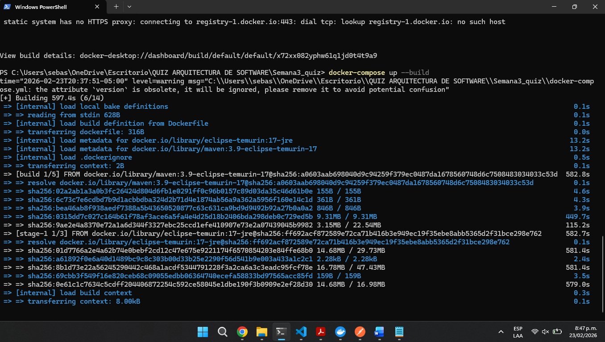

# FASE 1 — Levantar el ambiente
Clona el repositorio y levanta el proyecto:

Criterio de éxito: La app responde en http://localhost:8080/health con {"ok": true}

EJECUTANDO:

# FASE 2 — Auditoría del código

| #  | Descripción del problema                                                                 | Archivo              | Línea aprox.        | Principio violado                          | Riesgo |
|----|------------------------------------------------------------------------------------------|----------------------|---------------------|--------------------------------------------|--------|
| 1  | Construcción de SQL concatenando parámetro u directamente en la consulta                | UserRepository.java | 22                  | Seguridad – SQL Injection                  | Alto   |
| 2  | Uso de Statement en vez de PreparedStatement                                             | UserRepository.java | 20, 36              | Seguridad / Buenas prácticas JDBC          | Alto   |
| 3  | Credenciales de base de datos hardcodeadas en el código                                 | UserRepository.java | 13–15               | Seguridad / Clean Code                     | Alto   |
| 4  | No se cierran conexiones, statements ni ResultSet                                       | UserRepository.java | 18–31, 34–38        | Buenas prácticas / Gestión de recursos     | Alto   |
| 5  | Uso de MD5 para hashing de contraseñas                                                   | AuthService.java    | 66                  | Seguridad (hash inseguro)                  | Alto   |
| 6  | Se retorna el hash de la contraseña en la respuesta del login                           | AuthService.java    | 31, 36              | Seguridad – Exposición de datos            | Alto   |
| 7  | Clase User con atributos públicos                                                        | User.java           | 4–6                 | Encapsulamiento / Clean Code               | Medio  |
| 8  | Nombres poco descriptivos (u, p, e, r, c, s)                                             | Varios archivos     | múltiples           | Clean Code – Naming                        | Bajo   |
| 9  | AuthService hace demasiadas responsabilidades (login, hashing, logs, reglas de password)| AuthService.java    | 18–63               | SOLID – SRP                                | Medio  |
| 10 | Validación débil de contraseña (solo longitud > 3)                                      | AuthService.java    | 45                  | Seguridad básica                           | Medio  |
| 11 | Uso de System.out.println para eventos sensibles                                         | AuthService.java    | 24–25, 32–33, 53–54 | Seguridad / Buenas prácticas logging       | Medio  |
| 12 | Uso de Map<String,Object> como respuesta en vez de DTO tipado                           | AuthController.java | 20, 26              | Clean Code / Diseño                        | Bajo   |

---

# FASE 3 — Pruebas funcionales

